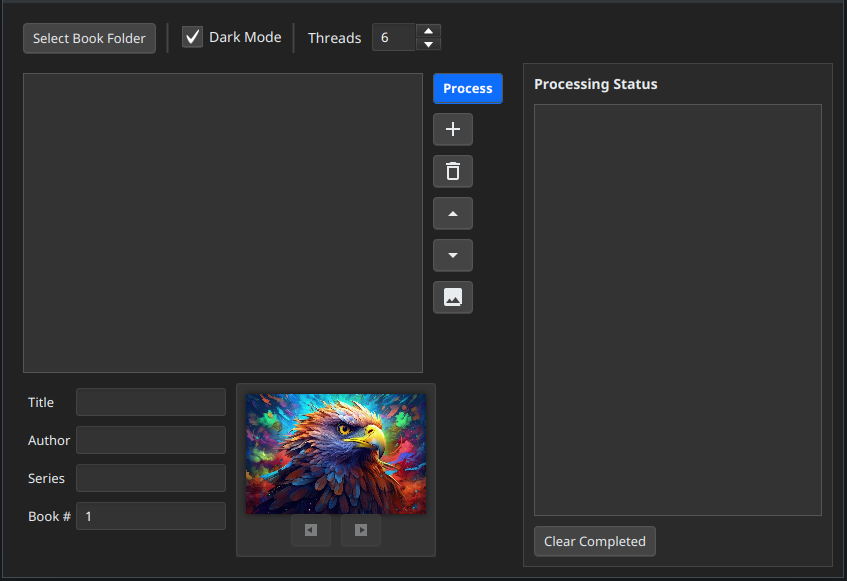

# Audiobook Creator
A desktop application for creating and managing audiobooks from various audio file formats. This tool helps you combine multiple audio files into a single M4B audiobook file with proper metadata and cover art.

## Features
- **Audio File Management**: Add, remove, and reorder audio files with intuitive controls
- **Drag & Drop Support**: Simply drag audio files into the application
- **Automatic Sorting**: Smart sorting of audio files based on file names
- **Cover Image Support**: Automatically finds cover images in audio folders and allows custom image selection
- **Metadata Editing**: Edit title, author, series name, and book number
- **M4B Conversion**: Combines multiple audio files into a single M4B file
- **Smart Metadata**: Automatically suggests metadata based on history and file name
- **Multi-threading**: Parallel processing for faster conversion of large audiobooks
- **Dark/Light Themes**: Choose your preferred visual style
- **Processing Queue**: Process multiple audiobooks simultaneously with visual progress tracking
- **Audio Quality Choice**: Choose between very high audio quality or reasonable audio quality for books at half the file size
- **Cross-Platform**: Available as native installers for Windows and Linux, with a universal JAR that runs anywhere Java is installed
- **Privacy Friendly**: Works completely offline with no data collection

## Supported Audio Formats
- MP3 (.mp3)
- WAV (.wav)
- AAC (.aac, .m4a)
- FLAC (.flac)
- OGG Vorbis (.ogg)
- M4B (.m4b)

## Installation

### Windows
1. Download the latest `.exe` file from the [Releases](https://github.com/jonask24/AudiobookCreator/releases) page
2. Run the installer (`AudiobookCreator-x.x.exe`)
3. Follow the installation wizard instructions

### Linux (Debian based)
1. Download the latest `.deb` file from the [Releases](https://github.com/jonask24/AudiobookCreator/releases) page
2. Install using package manager:  
   `sudo apt install ./AudiobookCreator-x.x.deb`
4. If you want to remove the application:  
   `sudo apt remove audiobook-creator`
